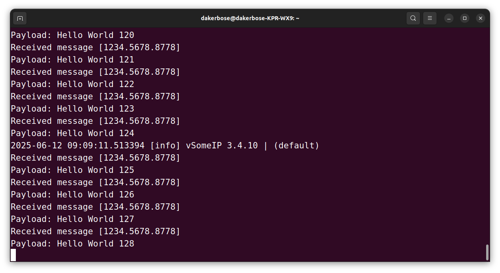
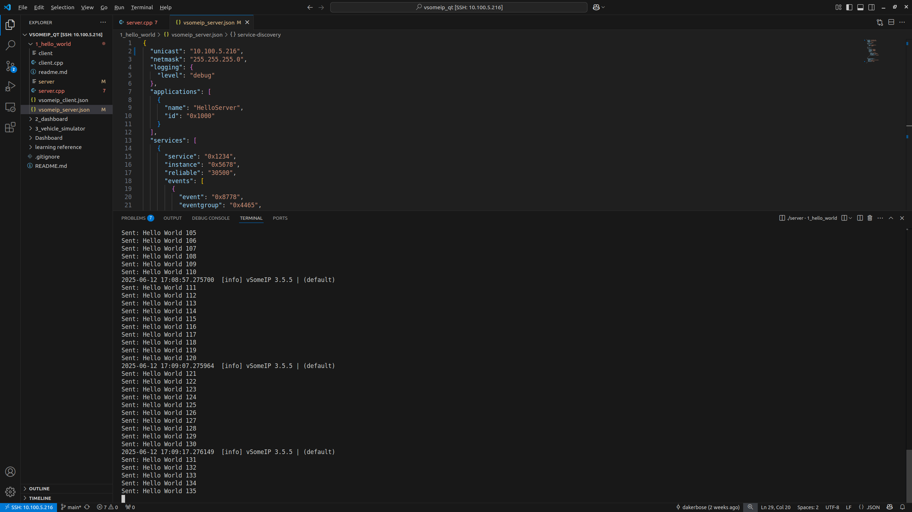

# 简易工程智能座舱开发
## 基于vsomeip_qt_qnx

1_hello_world的内容是实现服务器和客户端发送hello 主要是基础功能测试 具体内容可以查看里面的readme

2_dashboard的内容是仪表盘的显示 目前因为实际设备的限制和工具链受限 只能在linux上面显示 在qnx上面目前显示屏不太行

3_vehicle_simulator的内容是驾驶模拟器的实现 后面会加入大模型对话的内容 目前是在rapspberry实现 后面考虑迁移到rk3576中 利用npu加速

Dashboard是前面二者的qmake实现 我不习惯qt-creator 这部分可以忽略或者参考

source存了本项目readme的图片资源

vsomeip_qnx子仓库是基于vscode qnx toolkit和qnx800工具栏链的实现 主要是实现交叉编译 qnx系统中是没有类似于linux的编译器

## QNX客户端和Linux服务端通讯收发实验
二者均使用ssh和主机连接




## 双Linux的仪表盘-控制器收发实验

## 开发过程中遇到的问题

1. ssh远程登录时无法展示qt  
   解决方案:  启用X11转发
            ssh -X dakerbose@10.100.5.216

2. commication.cpp开发过程中资源未被正确释放
   
   首先以为是主线程的问题 加了这个pthread_join(tid_com, NULL)； 明显是不对的 这样直接阻塞在那里了 下一句app执行不了

   改称线程分离 我觉得是有必要的 pthread_detach(tid_com);
   
   然后问题仍然在
   ```
   2025-06-13 18:14:52.511197  [debug] Thread destroyed. Number of active threads for Dashboard : 0
   ```

   证明 还是要分离 不然run()退出不了