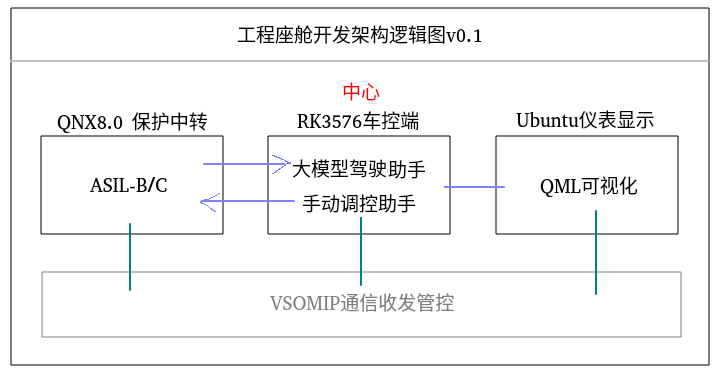
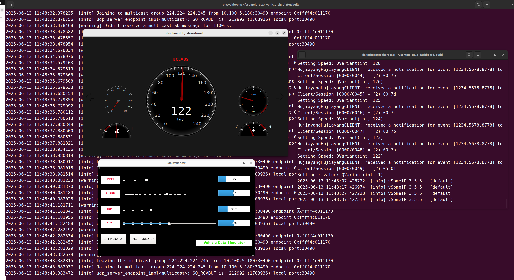
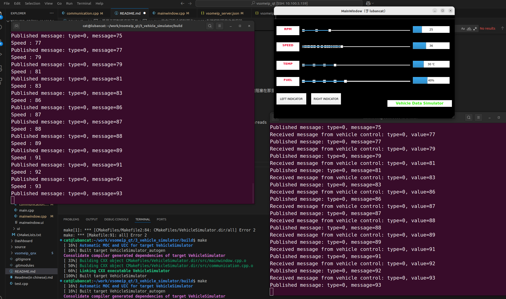
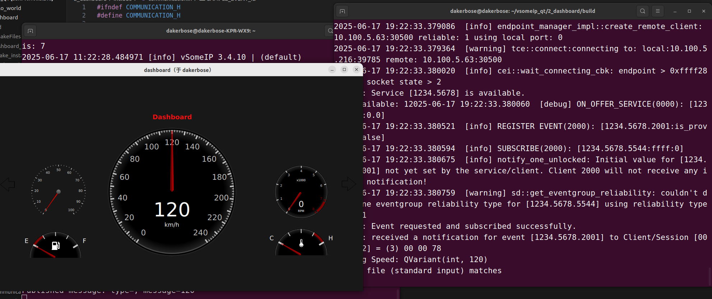

# 简易工程智能座舱开发
本项目开发了一套遵循Autosar AP的离线式智能座舱车控与交互系统，基于vsomeip通信SOA中间件，以RK3576 ubuntu车控端为中心，完成同树莓派qnx安全端、树莓派ubuntu仪表盘的三域交互，实现DeepSeek大模型推理、QT车控-仪表盘可视化、TTS语音合成-双缓冲队列、QNX安全守护五大核心任务。

功能上说就是利用车控RK实现车速这种变化，同步给仪表盘，然后QNX认为要报警了 就通知RK ，rk大模型进行语音提示。

目前实现语音提示 仪表盘 模型推理等等工作 还差一个就是实现QNX认为要报警就去推理这个事情。


## 基于vsomeip qt qnx 下面是各个文件夹的含义

1_hello_world的内容是实现服务器和客户端发送hello 主要是基础功能测试 具体内容可以查看里面的readme

2_dashboard的内容是仪表盘的显示 目前因为实际设备的限制和工具链受限 只能在linux上面显示 在qnx上面目前显示屏不太行

3_vehicle_simulator的内容是驾驶模拟器的实现 后面会加入大模型对话的内容 目前是在rapspberry实现 后面考虑迁移到rk3576中 利用npu加速

Dashboard是前面二者的qmake实现 我不习惯qt-creator 这部分可以忽略或者参考

source存了本项目readme的图片资源

vsomeip_qnx子仓库是基于vscode qnx toolkit和qnx800工具栏链的实现 主要是实现交叉编译 qnx系统中是没有类似于linux的编译器

## QNX客户端和Linux服务端通讯收发实验
二者均使用ssh和主机连接


## 双Linux的仪表盘-控制器收发实验

### 开发过程中遇到的问题

1. ssh远程登录时无法展示qt  
   解决方案:  启用X11转发
            ssh -X dakerbose@10.100.5.216

2. commication.cpp开发过程中资源未被正确释放
   
   首先以为是主线程的问题 加了这个pthread_join(tid_com, NULL)； 明显是不对的 这样直接阻塞在那里了 下一句app执行不了

   改称线程分离 我觉得是有必要的 pthread_detach(tid_com);
   
   然后问题仍然在
   ```
   2025-06-13 18:14:52.511197  [debug] Thread destroyed. Number of active threads for Dashboard : 0
   ```

   证明 还是要分离 不然run()退出不了


后续是移植到了RK3576中

## QNX的中间安全控制器与RK3576车端控制器的收发实验

### 开发过程中遇到的问题
1. 对于QNX的开发 首先是要注意vscode环境的配置 然后要知道 vsomeip 里面一个服务不可以是即收又发，这样会导致冲突



## QNX的中间安全控制器与仪表盘的显示实验
### 开发过程中遇到的问题
最大的难点是如何在一个vsomeip中实现接收和发送，但是在这个智能座舱开发的过程中，很明显就是发现接收的线程干扰了发送的 目前只能在发送的时候屏蔽掉接收的逻辑


这个并不是必须的 这二者应该是分离的 因此重点还是关注车控逻辑
